# SQL_DataCleaning

## This project will be working for Data Cleaning in SQL.

## -- 1. Load data
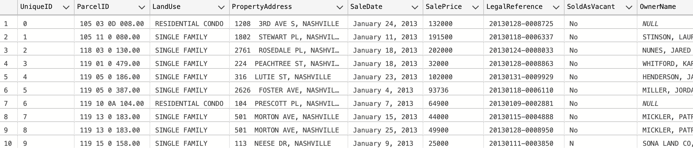

## -- 2. Convert SaleDate form to DATE

### ---- 2.1 Preview Initial Table 
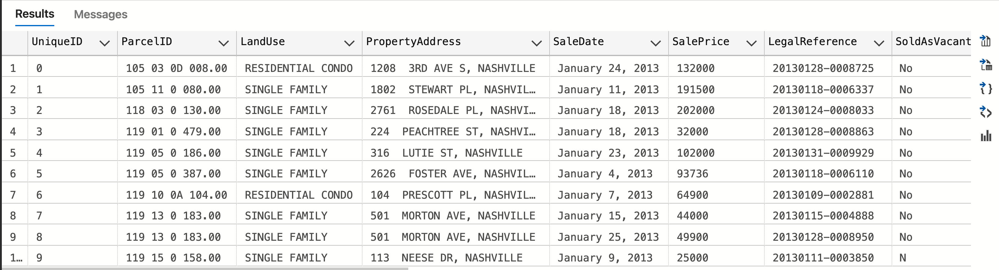

### ---- 2.2 Standardize Date Format
#### ---- 2.2.1 Preview Converting SaleDate to DATE
#### ---- 2.2.3 Confirm SaleDate has already converted to DATE 
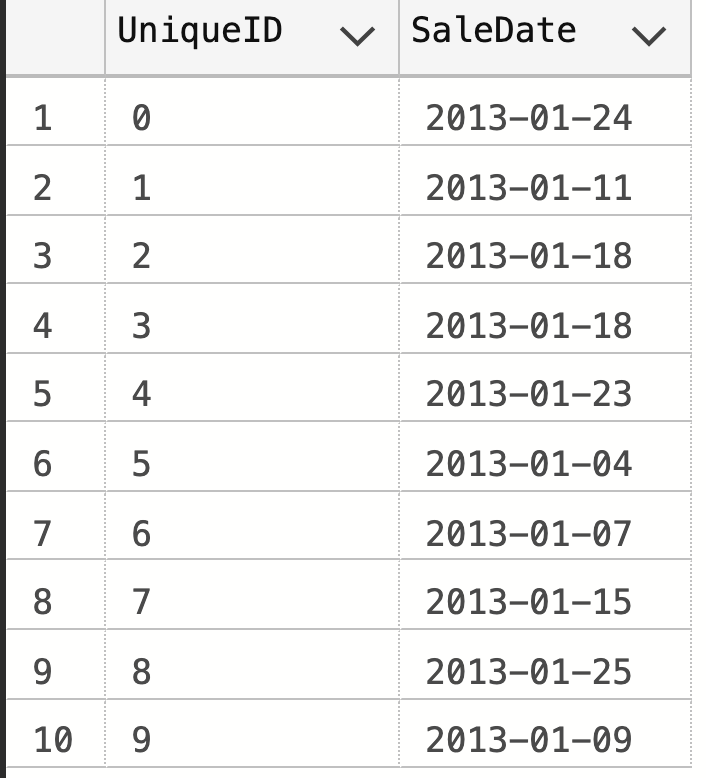

## -- 3. Populate Property Address Data
### ---- 3.1 Preview rows without PropertyAddress
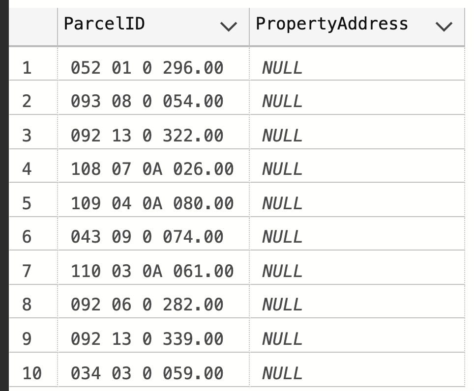

### ---- 3.2 Preview converting a's PropertyAddress to b's
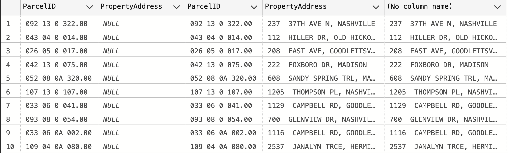

### ---- 3.3 Converting a's PropertyAddress to b's
### ---- 3.4 Checking rows with new PropertyAddress
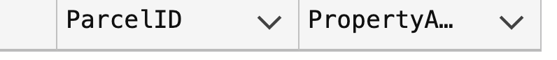

## -- 4. Break PropertyAddress into columns (Address, City)
### ---- 4.1 Preview current columns before adding new columns
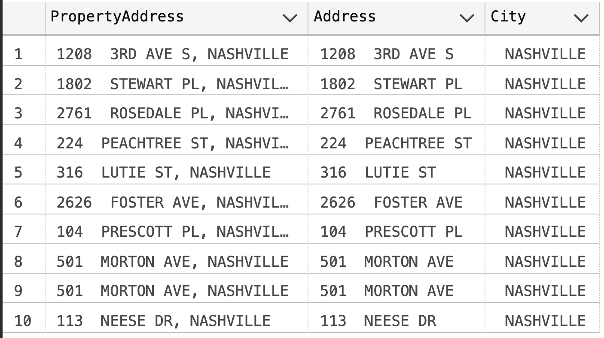

### ---- 4.2 Add PropertySplitAddress and PropertySplitCity columns 
#### -- Address 
#### -- City

### ---- 4.3 Checking new added columns
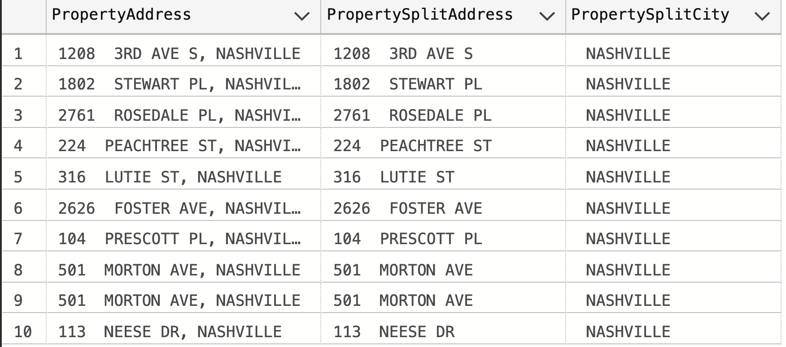

## -- 5. Break OwnerAddress into columns (Address, City, State)
### ---- 5.1 Preview columns
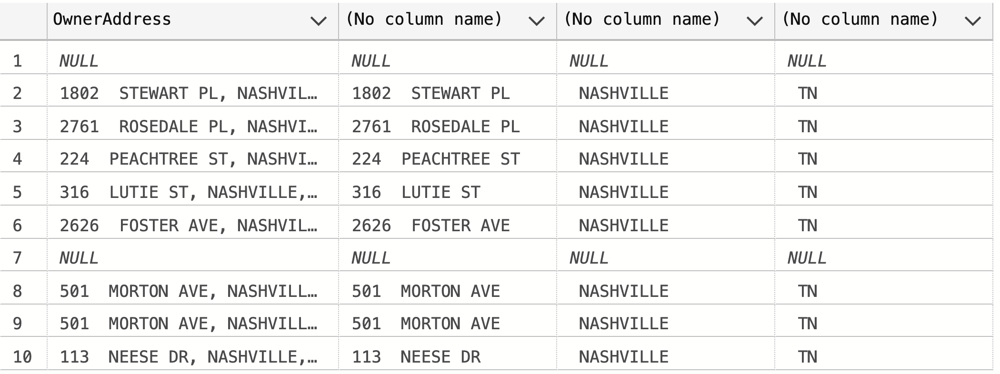

### ---- 5.2 Adding new columns 
#### ---- 5.2.1 Adding 'OwnerSplitAddress' Column
#### ---- 5.2.2 Adding 'OwnerSplitCity' Column
#### ---- 5.2.3 Adding 'OwnerSplitState' Column

### ---- 5.3 Checking new added column
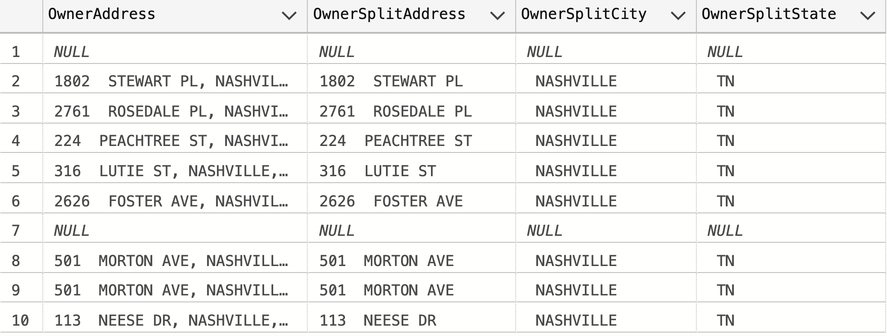

## -- 6. Change Y and N to Yes and No in "Sold as Vacant" field
### ---- 6.1 Display the numbers of SoldAsVacant values
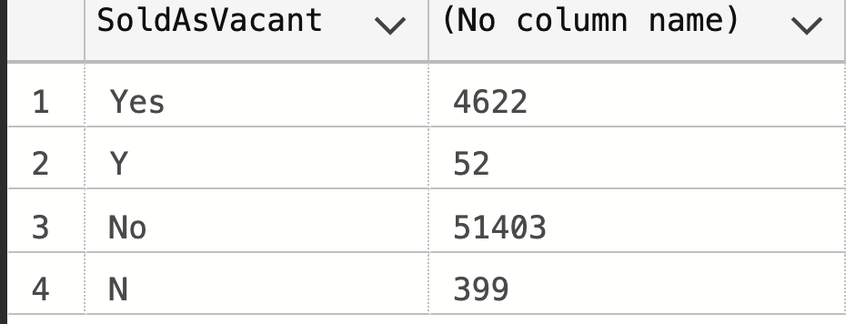

### ---- 6.2 Preview converting from 'Y' and 'N' to 'Yes' and 'No'
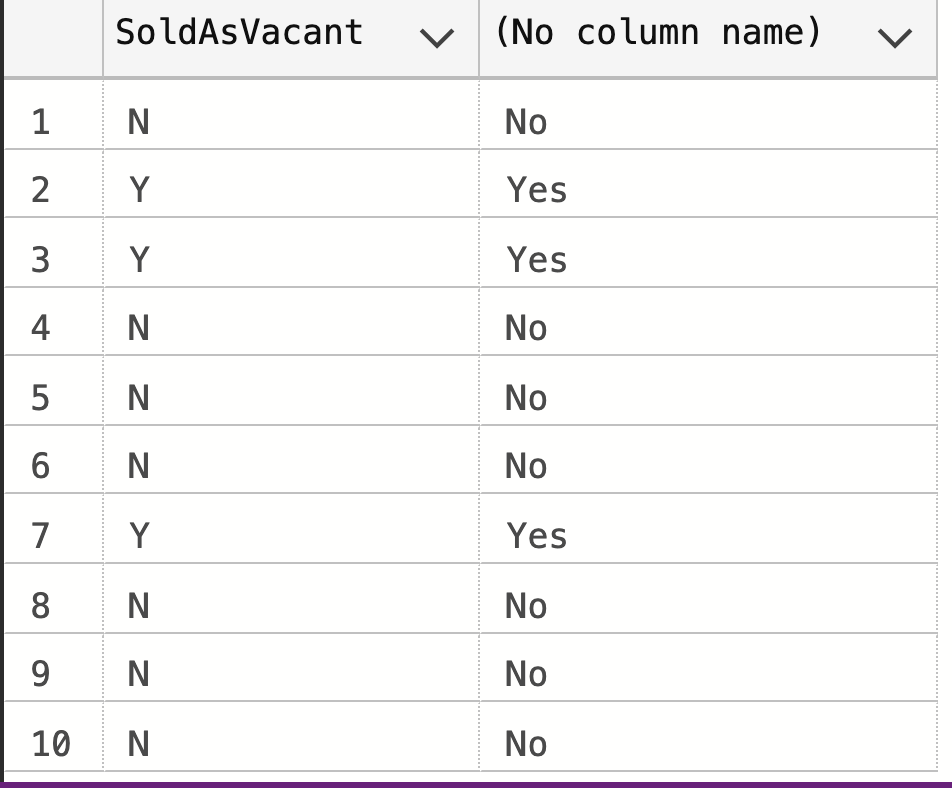

### ---- 6.3 Converting 'Y' and 'N' to 'Yes' and 'No'
### ---- 6.4 Checking 'Y' and 'N' have been replaced to 'Yes' and 'No'
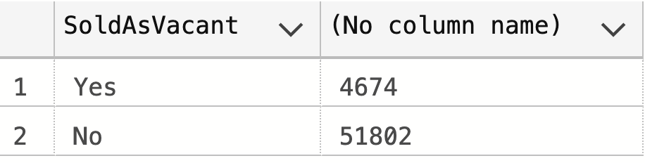

## -- 7. Remove Duplicates
### ---- 7.1 Display duplicate rows with CTE
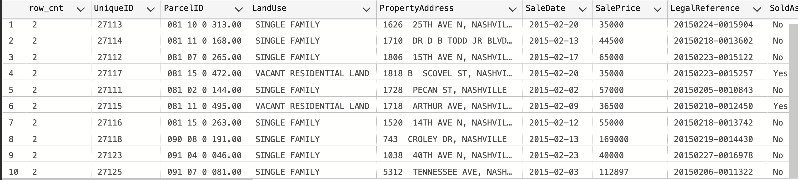

### ---- 7.2 Remove duplicate rows
### ---- ---- 7.3 Checking duplicate rows have been removed
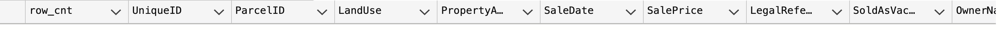

## -- 8. Delete Unused Columns
### ---- 8.1 Display table and find unused columns to drop
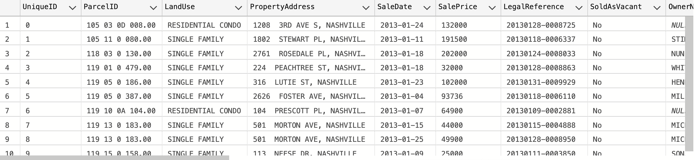

### ---- 8.2 Drop unused columns
### ---- 8.3 Display final table
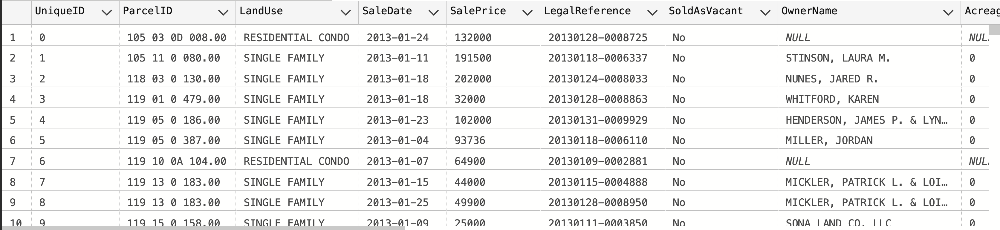